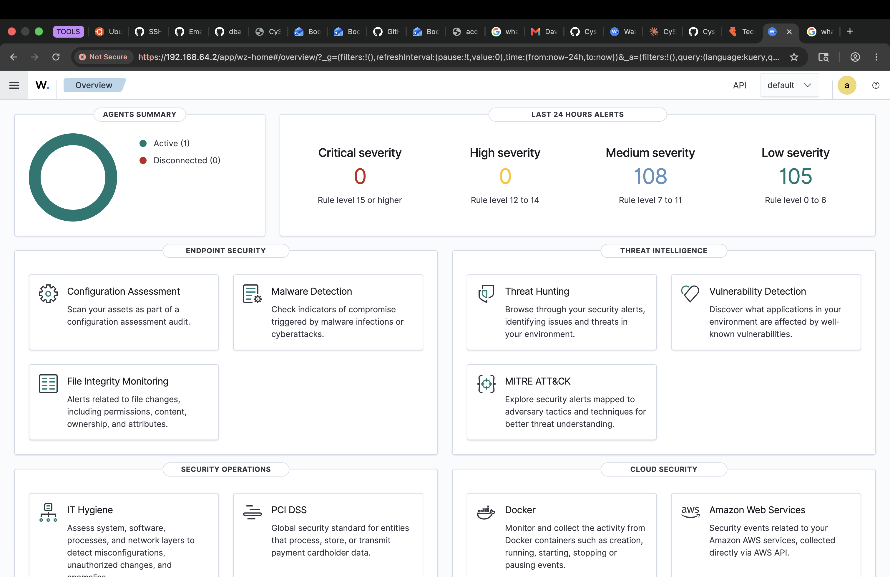
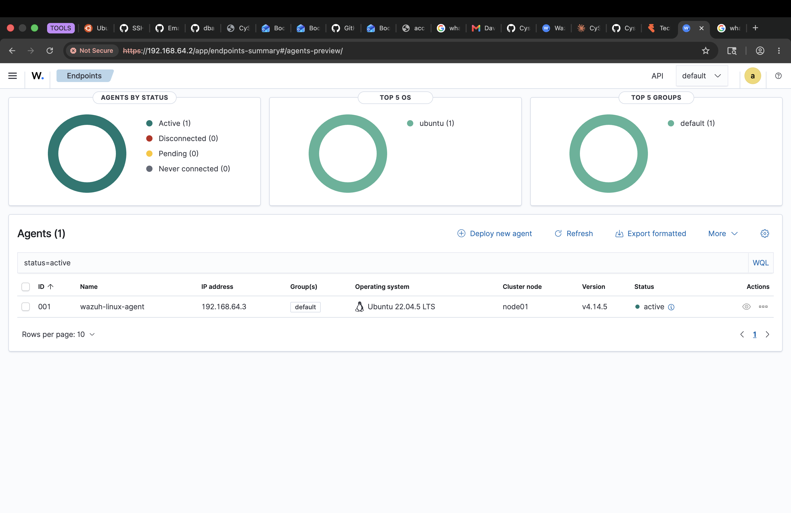

# Cysa-p01-wazuh-siem

Project 1 of my CompTIA CySA+ (CS0-003) portfolio: building and operating a **Wazuh SIEM** lab from scratch, then using it for detection engineering with Linux endpoint agents.

The goal of this project is to stand up a real Security Information and Event Management (SIEM) platform, connect a monitored endpoint to it, and document the build — including the problems I ran into and how I solved them — the way a SOC analyst would.

## What I built

A two-VM Wazuh lab running on Apple Silicon (M-series Mac) using UTM virtualization:

| Role | Hostname | IP | Specs | OS |
|------|----------|-----|-------|-----|
| SIEM server (all-in-one: indexer + manager + dashboard) | `wazuh-server` | 192.168.64.2 | 4 vCPU / 6 GB / 60 GB | Ubuntu Server 22.04.5 LTS (ARM64) |
| Monitored endpoint (Wazuh agent) | `wazuh-linux-agent` | 192.168.64.3 | 2 vCPU / 3 GB / 30 GB | Ubuntu Server 22.04.5 LTS (ARM64) |

The agent reports security telemetry (file integrity, log data, system audit) back to the server, where it is analyzed and surfaced as alerts in the Wazuh dashboard.

## Results

**The Linux agent enrolled successfully and reports as Active in the dashboard.**

*The dashboard overview: one agent Active, zero disconnected, and alerts already flowing in (108 medium-severity, 105 low-severity) from the agent's first check-in — file integrity baseline and system audit events.*

*Agent detail view confirming `wazuh-linux-agent` (ID 001) at 192.168.64.3, running Ubuntu 22.04.5 LTS, Wazuh v4.14.5, status Active.*

## Build environment & key decisions

- **Virtualization:** UTM (QEMU backend) rather than VirtualBox, because the build machine is Apple Silicon (ARM). All Ubuntu images are the **ARM64** (`aarch64`) builds to match.
- **OS version:** Stayed on Ubuntu **22.04 LTS** rather than 24.04 for Wazuh compatibility.
- **Wazuh version:** 4.14.5, installed via the all-in-one installer script.

## Problems I hit (and fixed)

Documenting these because troubleshooting is the job.

- **Wazuh 4.9 installer rejected ARM64.** The older installer's architecture check only recognized x86 and falsely reported "must be run on a 64-bit system." **Fix:** used the 4.14 installer, which supports ARM64.
- **Manager and agent can't coexist on one host.** I first tried installing a Wazuh agent on the server VM for "self-monitoring," but the `wazuh-agent` package conflicts with `wazuh-manager` by design. **Fix:** built a separate VM (`wazuh-linux-agent`) to act as the monitored endpoint — which also matches the standard SIEM architecture of a central server plus distributed agents.
- **VM rebooting into the installer.** After the Ubuntu install finished, the VM kept booting back into the installer ISO. **Fix:** ejected the install ISO from the virtual CD/DVD drive before rebooting.
- **LVM not using the full disk.** Ubuntu's guided storage only allocated ~half the virtual disk to root by default. **Fix:** manually expanded the logical volume to use the full disk during install.

## Project structure

- `screenshots/` — Lab screenshots (Wazuh dashboard, agent registration, alerts)
- `configs/` — Wazuh server and agent configuration files
- `scripts/` — Python utilities, including `wazuh-alert-summary.py`
- `docs/` — Setup notes, troubleshooting, and lessons learned
  - [`04-ubuntu-install.md`](docs/04-ubuntu-install.md) — Ubuntu Server install walkthrough

## Status

✅ SIEM server deployed · ✅ Linux agent enrolled and Active

🚧 In progress: detection demos (triggering and capturing alerts), alert-summary script, and additional docs.
